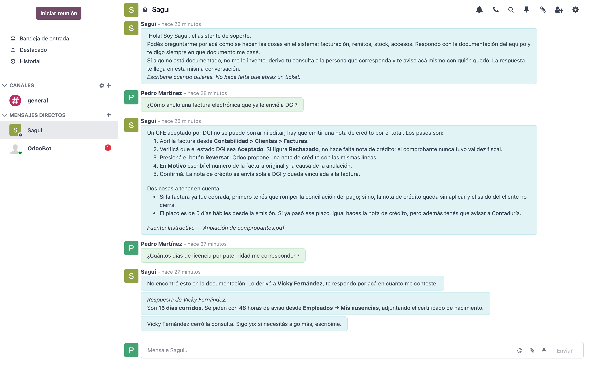
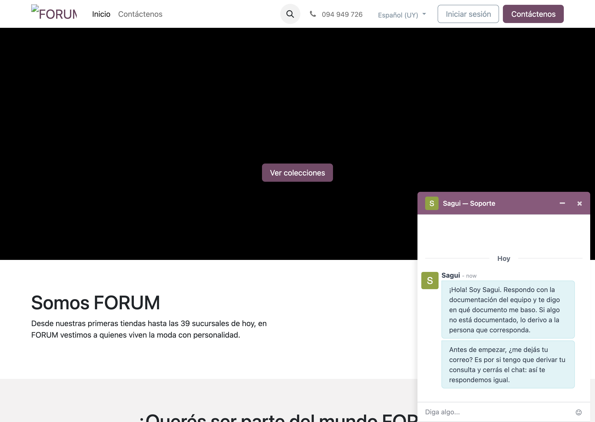
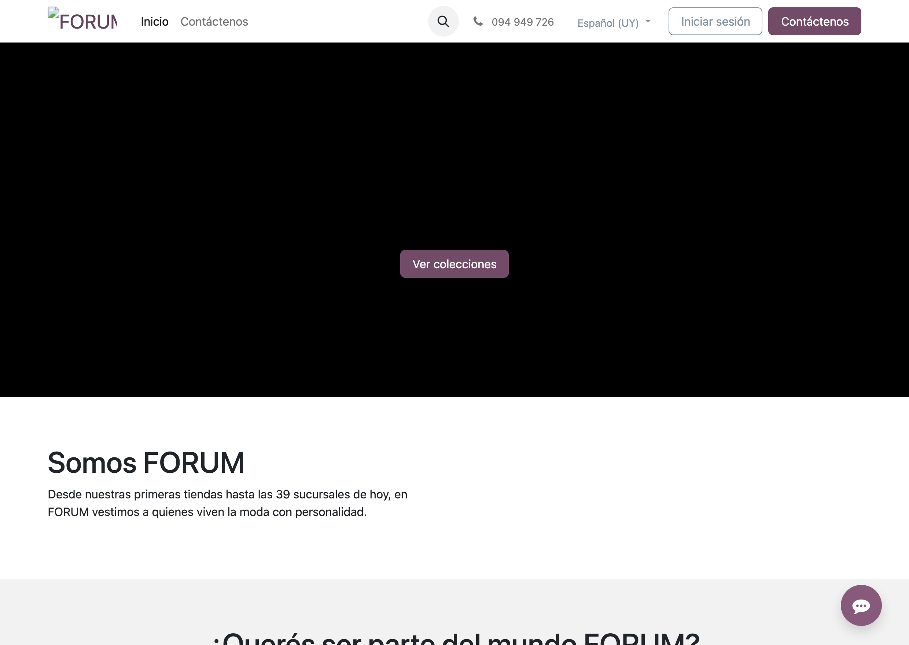
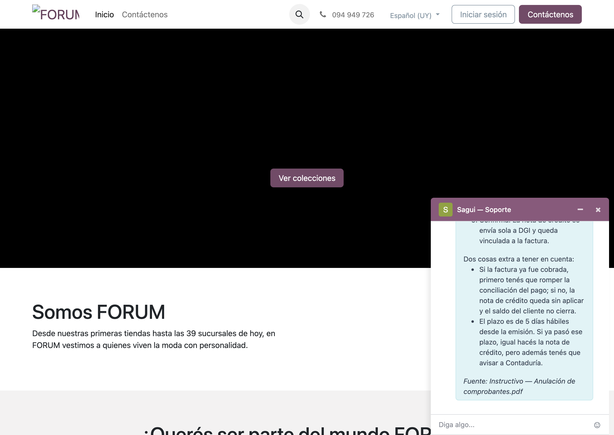
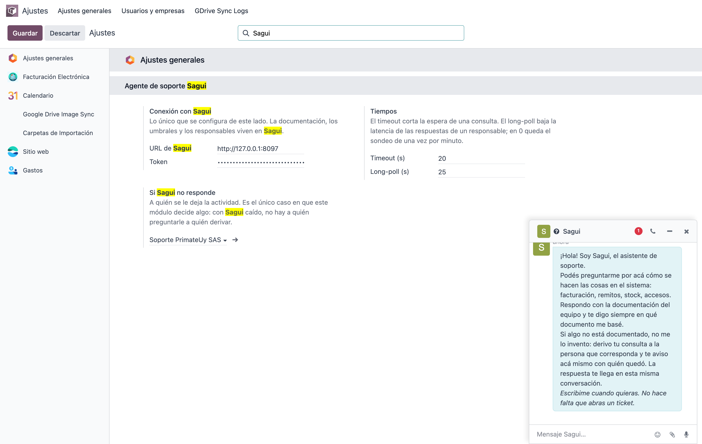
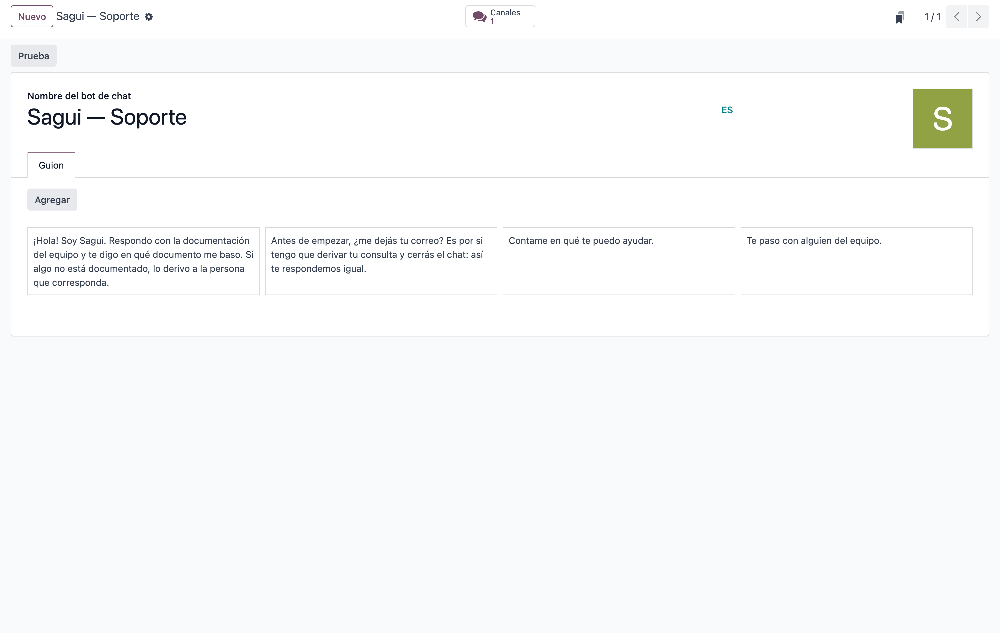

# Sagui, el asistente de soporte — Manual de uso

**Para el equipo de Forum.**

Sagui es un asistente que responde consultas sobre cómo se hacen las cosas en el sistema. Responde
con la documentación del equipo y te dice en qué documento se basó. Cuando algo no está documentado
no lo inventa: se lo pasa a la persona que sabe y te avisa con quién quedó.

Este manual tiene tres partes. Cada una es para alguien distinto:

- **Parte 1** — si trabajás en Forum y querés preguntarle algo.
- **Parte 2** — si entrás desde el sitio web, como visitante.
- **Parte 3** — si administrás el sistema.

---

# Parte 1 · Para el equipo de Forum

## Quién es y dónde está

Sagui aparece en **Conversaciones** (el icono de chat de la barra de arriba) como un contacto más.
La primera vez te deja un mensaje presentándose, así que no hay nada que configurar: está ahí.

## Cómo preguntarle

Escribile como le escribirías a un compañero. No hay comandos ni palabras clave.

1. Abrir **Conversaciones**.
2. Buscar **Sagui** en la lista de la izquierda.
3. Escribir la pregunta y mandar.


Preguntas que funcionan bien:

> *¿Cómo anulo una factura electrónica que ya le envié a DGI?*
> *¿Qué hago si un remito salió con la cantidad equivocada?*
> *¿Cuántos días de licencia por paternidad me corresponden?*

Un consejo que sale de usarlo: **preguntá con varias palabras.** «¿Y eso?» o «factura» no alcanzan
—Sagui te va a pedir que lo cuentes con un poco más de detalle—, porque con una sola palabra no
puede saber si la documentación cubre lo que necesitás.

## Qué esperar

### Cuando la respuesta está documentada

Te contesta en unos segundos y **te dice de dónde lo sacó**, con una línea al pie:

> Un CFE aceptado por DGI no se puede borrar ni editar; hay que emitir una nota de crédito por el
> total.
>
> **Pasos**
> 1. …
>
> *Fuente: Instructivo — Anulación de comprobantes.pdf*

Esa línea de fuente está para que puedas verificarlo. Si la respuesta te resulta rara, abrí el
documento: es el que el equipo escribió.

### Cuando no está documentado

Sagui no improvisa. Te avisa en el momento con quién quedó tu consulta:

> No encontré esto en la documentación. Lo derivé a **Vicky Fernández**, te respondo por acá en
> cuanto me conteste.

Y después, **la respuesta te llega en ese mismo chat**, firmada con el nombre de quien la contestó:

> *Respuesta de Vicky Fernández:*
> Son **13 días corridos**. Se piden con 48 horas de aviso desde **Empleados → Mis ausencias**,
> adjuntando el certificado de nacimiento.



Tres cosas que conviene saber sobre esto:

**No tenés que hacer nada.** No abras un ticket, no escribas a nadie más, no repitas la pregunta. La
respuesta va a llegar a este chat.

**Podés seguir escribiendo.** Si mientras esperás te acordás de un dato —el número de la factura, qué
probaste— escribilo nomás. Le llega a la misma persona, junto con tu consulta.

**Cuando el tema se cierra, Sagui te lo dice** y vuelve a atenderte él:

> Vicky Fernández cerró la consulta. Sigo yo: si necesitás algo más, escribime.

Si nadie contesta en 24 horas, Sagui cierra la consulta solo y te avisa para que puedas volver a
escribir.

## Si algo no sale como esperabas

| Lo que ves | Qué significa |
|---|---|
| «No me queda claro qué necesitás» | la pregunta era muy corta. Contala con más palabras. |
| «Estoy con problemas para consultar la documentación» | hay una falla técnica. Ya quedó avisado alguien del equipo. |
| Sagui no contesta nada | avisale al administrador: ver la Parte 3. |

---

# Parte 2 · Para quien entra desde el sitio

## El chat del sitio

En el sitio web hay un chat de soporte. Lo atiende Sagui, con el mismo criterio: responde con la
documentación del equipo y deriva a una persona cuando no alcanza.





**Sagui atiende siempre primero, haya o no gente del equipo conectada.** No hace falta que alguien
esté disponible para que puedas escribir: el chat está ahí a toda hora, y una persona entra recién
si Sagui deriva tu consulta.

Al abrirlo, lo primero que ves es el saludo y el pedido del correo. Después preguntás, y Sagui te
responde ahí mismo diciéndote en qué documento se basó:



## Por qué te pide el correo al principio

Antes de empezar, el chat te pide tu correo. **No es para registrarte ni para mandarte nada más.**

Es por un caso concreto: si tu consulta tiene que ir a una persona, la respuesta puede tardar un
rato —minutos, o más si es algo que hay que averiguar—. Si en el medio cerrás la pestaña, el chat se
termina y no hay forma de encontrarte. **Con tu correo, la respuesta te llega igual.**

Si preferís no dejarlo, podés seguir sin problema: el chat te avisa en ese momento que, si cerrás
antes de que contesten, no van a poder responderte.

## Qué pasa si cerrás el chat antes de la respuesta

Si dejaste tu correo, **te llega un mail** con la respuesta. El asunto arranca con tu consulta, para
que lo reconozcas entre todo lo demás:

> **Asunto:** Tu consulta: Necesito saber cómo anulo un comprobante que ya le mandé a la DGI…
>
> Hola, te escribimos porque cerraste el chat antes de que pudiéramos responderte. Esto es lo que te
> contesta Vicky Fernández:
>
> Se anula con una **nota de crédito** por el total.
>
> *Si necesitás seguir, respondé este correo o volvé a escribirnos por el chat del sitio.*

Si no dejaste el correo, la respuesta queda registrada del lado del equipo, pero no hay a dónde
enviártela. Por eso el chat te lo pide al principio.

---

# Parte 3 · Para el administrador de Forum

> **Esta parte es para quien administra el sistema.** Si sos un usuario normal y entrás a Ajustes,
> Odoo te va a decir «Error de acceso: no puede acceder a los registros Ajustes de configuración».
> No está roto: hace falta el permiso de administración, y si lo necesitás se pide.

## 3.1 La pantalla de Ajustes

**Ajustes → Ajustes generales**, sección **Sagui — Agente de Soporte**. Si la lista es larga,
escribí «Sagui» en el buscador de arriba y la pantalla se filtra sola.



La pantalla tiene tres bloques:

**Conexión con Sagui**

| Campo | Qué es | Valor habitual |
|---|---|---|
| **URL de Sagui** | dónde está el servidor que responde | la que te da Primate |
| **Token** | la credencial del cliente | la que te da Primate |

**Tiempos**

| Campo | Qué es | Valor habitual |
|---|---|---|
| **Timeout (s)** | cuánto se espera una respuesta antes de darla por perdida | `20` |
| **Long-poll (s)** | cuánto se deja la conexión abierta esperando la respuesta de un responsable. En `0`, las respuestas llegan por el sondeo de una vez por minuto | `25` |

**Si Sagui no responde** — a quién se le deja la actividad. Ver más abajo.

En el día a día sólo se tocan la URL y el token.

### La URL y el token

Los da Primate. El **token se muestra una sola vez** cuando lo generan: si se perdió, hay que pedir
uno nuevo —no se puede recuperar—, y generar uno nuevo **desactiva el anterior**, así que el chat
deja de responder hasta que lo pegues acá.

### El responsable de respaldo

Es para un caso puntual: **Sagui no contesta** (está caído, o hay un problema de red). Cuando eso
pasa, el usuario recibe un mensaje digno —«Estoy con problemas para consultar la documentación en
este momento. Ya avisé a alguien del equipo»— y a esta persona le queda una actividad con la consulta
que no se pudo atender.

Sin esta configuración el usuario recibe el aviso igual, pero nadie del equipo se entera. Conviene
poner a alguien que mire sus actividades.

## 3.2 El guion del chat del sitio

El chat del sitio funciona con un guion de cuatro pasos, en este orden:

| # | Paso | Qué hace |
|---|---|---|
| 1 | Saludo | se presenta y explica cómo trabaja |
| 2 | Pide el correo | para poder responder si el visitante cierra el chat |
| 3 | Conversación | acá es donde atiende Sagui |
| 4 | **Pase a un operador** | deja la conversación en manos de una persona |



### La regla que conecta el guion con el sitio

El guion no se activa solo: lo engancha una **regla del canal de chat en vivo**, en
**Chat en vivo → Canales → Soporte Primate → pestaña Reglas**. Dos campos deciden todo:

| Campo | Valor correcto | Por qué |
|---|---|---|
| **Bot de chat** | `Sagui — Soporte` | es lo que hace que atienda Sagui. Sin esto, el visitante cae directo en una persona. |
| **Solo si no hay operador** | **desmarcado** | marcado, Sagui atendería únicamente cuando no hay nadie conectado. Queremos que atienda siempre. |
| **URL** | **vacío** | vacío = todas las páginas del sitio. |

> **El campo URL es una trampa.** Se compara contra la dirección completa de la página
> (`http://tusitio.com/...`), no contra la parte de después del dominio. Un valor que parece obvio
> para «sólo la portada», como `^/$`, **no coincide con ninguna página** — y el resultado no es un
> error visible: el chat deja de tener bot. Lo que se ve es que la burbuja no aparece cuando no hay
> nadie conectado, y que cuando hay alguien conectado el visitante habla con esa persona en vez de
> con Sagui.
>
> Si aparece ese síntoma, es esto. **Dejalo vacío.**

Para comprobar que la regla está tomando el guion, sin depender de lo que se ve en pantalla:

```bash
curl -s -X POST http://TU-SITIO/im_livechat/init \
     -H "Content-Type: application/json" -H "Referer: http://TU-SITIO/" \
     -d '{"jsonrpc":"2.0","method":"call","params":{"channel_id":1}}'
```

Si en la respuesta `rule` viene sin `chatbot`, la regla no está coincidiendo.

### ⚠ El paso 4 va último, y no se puede mover

**El «Pase a un operador» tiene que ser el último paso del guion. El sistema no te deja moverlo, y
conviene entender por qué.**

Ese paso es lo que entrega la conversación a una persona de carne y hueso. Mientras el guion está en
el paso 3, es Sagui el que atiende; en cuanto se ejecuta el paso 4, Sagui sale y queda un operador.

Si el pase quedara antes del paso de conversación, **el visitante nunca hablaría con Sagui**: el
chat lo pasaría directo a una persona, y el asistente —con toda la documentación del equipo— no
atendería ni una consulta. No fallaría nada, no habría ningún error en pantalla: simplemente el
servicio no existiría, y desde afuera se vería como «Sagui no contesta».

Es un orden delicado por una razón de fondo: el orden de los pasos es un número, y el módulo de chat
de Odoo renumera esos números cuando se arrastra un paso en la pantalla. Por eso el sistema lo
verifica y lo impide en lugar de confiar en que nadie lo mueva.

Lo mismo vale para el **paso 2 (el correo)**: si se saca o se mueve después de la conversación, se
pierde la única forma de responderle a un visitante que cerró el chat.

## 3.3 Si el bot no responde

Lo primero: mirar el registro del servidor y buscar esta línea, que está escrita para que se
encuentre:

```
Sagui soporte: EL BOT NO RESPONDIÓ en el canal <número> — falló el relay del DM
```

Si aparece, el mensaje del usuario llegó pero algo falló después. Inmediatamente debajo está el
detalle técnico del error, y eso es lo que hay que pasarle a Primate.

Otras líneas útiles en el mismo registro:

| Línea | Qué significa |
|---|---|
| `no pude consultar a Sagui (timeout)` | Sagui no contestó en el tiempo de paciencia. Revisar la URL y que el servidor de Primate esté arriba. |
| `no pude leer la cola (...)` | no se pueden traer las respuestas de los responsables. Mismo diagnóstico. |
| `Falta configurar la URL o el token` | están vacíos en Ajustes. |
| `respuesta de ... enviada por correo a ...` | normal: el visitante había cerrado el chat y la respuesta salió por mail. |

### Comprobación rápida

Si el chat no responde y querés descartar lo simple antes de llamar:

1. **Ajustes**: que la URL y el token estén cargados.
2. Que haya un **responsable de respaldo**, para que los fallos no pasen desapercibidos.
3. Mandarle un mensaje a Sagui por **Conversaciones** y esperar unos segundos. Si responde ahí, el
   puente funciona y el problema es del chat del sitio; si no responde en ninguno de los dos, el
   problema es el puente.

Si después de eso sigue sin responder, avisá a Primate con la línea del registro. Con eso se
diagnostica rápido.
